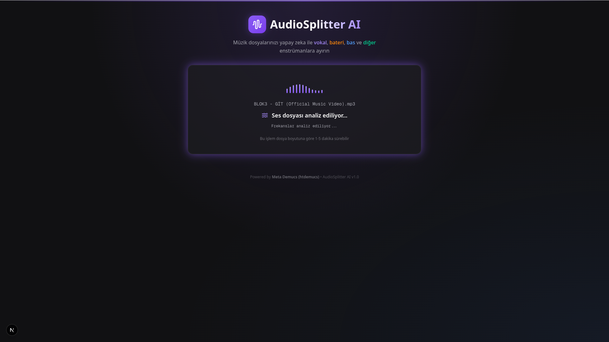
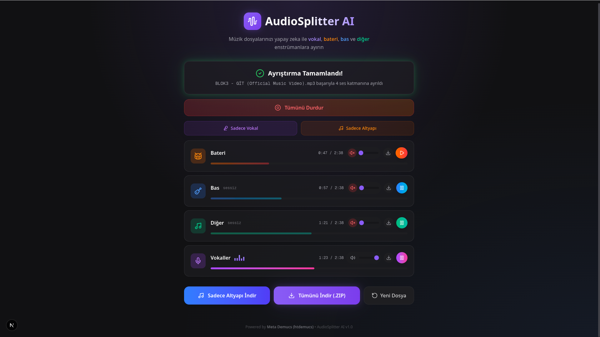
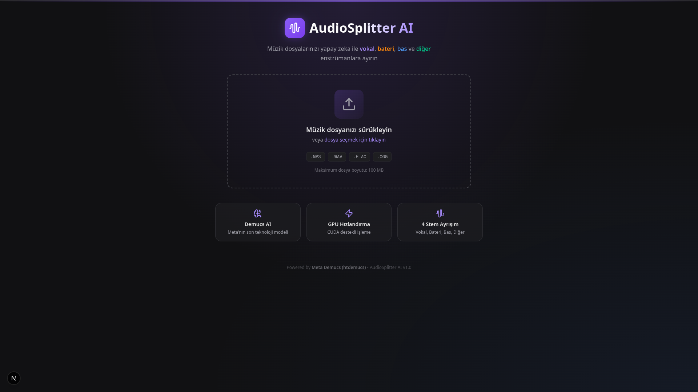

# 🎵 Sound Studio AI (AudioSplitter)

    

<br>
<p align="center">
  
</p>
<br>

**Sound Studio AI** is an advanced, AI-powered audio source separation application featuring a beautifully designed web interface. Utilizing Meta's state-of-the-art **Demucs v4 (`htdemucs_ft`)** high-fidelity model, the application accurately separates any music track into highly detailed stems: **Vocals, Drums, Bass, and Other**. On top of these core stems, it dynamically generates a pristine, high-quality **Instrumental** track, giving you complete flexibility for karaoke, remixing, or detailed audio analysis.

---

## ✨ Key Features

- 🧠 **High-Fidelity AI Separation:** Employs Meta's `htdemucs_ft` model to separate tracks into 4 precise stems (Vocals, Drums, Bass, Other) with unparalleled quality.
- 🎸 **Dedicated Instrumental Generation:** Automatically strips vocals to provide a pristine, combined instrumental backing track perfect for practicing, covers, and karaoke.
- ⚡ **Asynchronous Processing & Polling:** Delivers seamless background processing of large audio files without freezing your browser. Real-time status updates (Queued, Processing, Completed, Failed) keep you fully informed.
- 🎧 **Interactive Live Streaming:** Listen to and evaluate your separated stems directly within the browser before downloading. Supports complete HTTP Range Requests, meaning you can easily seek forward/backward directly via the UI.
- 📦 **One-Click Local Downloads:** Pick and choose specific stems (.mp3) or seamlessly download all generated stems packed into a single `.zip` archive.
- 🎨 **Sleek & Dynamic UI/UX:** A visually stunning application designed with Next.js and Tailwind CSS. The elegant dark mode combined with glassmorphism creates a highly premium user experience.
- 🚀 **Hardware Agnostic Audio I/O:** Custom architecture completely bypasses CUDA incompatibility issues often found on Linux by using `soundfile` instead of standard `torchaudio`.

---

## 📸 Screenshots & Walkthrough

### 1. Uploading & Intelligent Processing
When you drop an audio file into the application, a persistent background task takes over the heavy lifting. The frontend cleanly informs you whether the file is queued or currently under analysis using optimized short-polling.

<p align="center">
  
</p>

<br>

### 2. Live Audio Delivery & Export
Once Demucs v4 completes the source separation, a specialized audio player materializes for every stem (Vocals, Drums, Bass, Other, Instrumental). You can preview each track smoothly, seek through the timeline, and individually download or bundle everything instantly.

<p align="center">
  
</p>

---

## 🛠 Technology Stack

### 🎨 Frontend (Client)
- **Framework:** Next.js (React 19)
- **Styling:** Tailwind CSS v4, Lucide React (Icons), UI Micro-animations
- **Language:** TypeScript

### ⚙️ Backend (Server)
- **Framework:** FastAPI
- **AI Engine:** PyTorch, Demucs v4 (`htdemucs_ft`)
- **Audio I/O:** Soundfile, Numpy
- **Coroutines:** FastAPI BackgroundTasks, asyncio

---

## 📂 Project Architecture

```bash
sound-studio-ai/
├── .gitignore              # Explicit Git ignore rules prioritizing cleanliness
├── backend/                # Heavy-lifting FastAPI Server & AI Wrapper
│   ├── ai_engine.py        # Demucs AI model runtime and stream generation logic
│   ├── main.py             # FastAPI REST endpoints (Upload, Polling, Stream, Download)
│   ├── requirements.txt    # Essential Python dependencies
│   ├── utils.py            # Security sanitization and ZIP archive generation
│   ├── temp_uploads/       # (Auto-created) Temporary directory for raw uploads
│   └── temp_outputs/       # (Auto-created) Temporary directory for AI inferences
├── frontend/               # Premium Next.js React Web Application
│   ├── package.json        # Node.js dependencies
│   ├── postcss.config.mjs  # Tailwind transpilation
│   ├── tsconfig.json       # Strict TypeScript configuration
│   ├── app/                # Next.js App Router root directories
│   └── components/         # Highly decoupled UI layers (AudioPlayer, FileUploader)
└── README.md               # Extensive Project Documentation
```

---

## 🚀 Installation & Launch Guide

Bring **Sound Studio AI** locally to your powerful machine or cloud instance quickly. Ensure you boot both the APIs and Web interfaces in parallel.

### 1️⃣ Prerequisites
- **Python:** 3.10 or higher
- **Node.js:** 20.x or higher
- **Hardware Acceleration:** NVIDIA GPU with configured CUDA drivers strongly recommended for dramatic processing speed-up (gracefully falls back to CPU if unavailable).

### 2️⃣ Backend Installation

```bash
# 1. Navigate to the backend directory
cd backend

# 2. Spin up and activate a Virtual Environment
python -m venv ../.venv
source ../.venv/bin/activate  # On Windows: ..\.venv\Scripts\activate

# 3. Inject core AI requirements
pip install -r requirements.txt

# NOTE: If you are encountering slow GPU integration, ensure you install the PyTorch 
# distribution matching your localized CUDA version: https://pytorch.org/get-started/locally/
```

### 3️⃣ Frontend Installation

```bash
# 1. Navigate to the frontend directory
cd frontend

# 2. Build the Node modules
npm install
```

### 4️⃣ Booting the Studio

Ensure your virtual environment is active in the backend terminal before you spin the engine up.

**Terminal 1 (Backend API):**
```bash
cd backend
source ../.venv/bin/activate
python main.py
```
> *API Server goes live actively waiting at `http://localhost:8000`.*

**Terminal 2 (Frontend Interface):**
```bash
cd frontend
npm run dev
```
> *The glamorous web frontend spins up at `http://localhost:3000`. Pop this into your browser!*

---

## 📡 API Reference

The entire architecture is modularized strictly over state-independent REST APIs:

| HTTP Method | Endpoint | Description |
| :--- | :--- | :--- |
| `GET` | `/api/health` | Diagnostic routine verifying system readiness and GPU compute availability. |
| `POST` | `/api/upload` | Ingests a media payload via `multipart/form-data`, queues the inference, and issues a traceable `task_id`. |
| `GET` | `/api/status/{task_id}` | Long-polling friendly accessor dictating lifecycle tracking (queued -> processing -> completed) using the provided `task_id`. |
| `GET` | `/api/stream/{task_id}/{stem}` | Buffer-safe endpoint that transmits pure audio byte streams into the browser via `Range` implementations. |
| `GET` | `/api/download/{task_id}` | On-the-fly packing strategy compiling all inferenced stems and the instrumental into a lightweight `.zip` file. |
| `GET` | `/api/download/{task_id}/{stem}`| Retrieves a specific requested high-fidelity stem directly as an isolated `.mp3` object. |

---

## ⚠️ Known Linux / Torch Ecosystem Solutions

**1. `torchaudio` vs Native CUDA (Crucial for Arch Linux Users)**
- We strategically opted out of traditional `torchaudio` implementations primarily because installing complex Python packages on rolling-release OS structures (like Arch) introduces massive `cuDNN`/`libcublas` disparities resulting in broken AI processes.
- By defaulting the Audio Data Ingestion to `soundfile`, we significantly minimize library bleeding. If you still encounter pipeline crashes during rendering, enforce global system-level PyTorch installs via your OS package manager (`pacman`, `apt`) rather than `pip`.

**2. Asynchronous State Drops**
- Because inferences might take minutes, shutting down the server while a process is flagged active will result in orphaned states. Restart the backend daemon and simply drop your file locally to retry!

---

*Engineered as a bleeding-edge prototype combining Web Design capabilities with Deep AI Music Source Separation Technology.*
